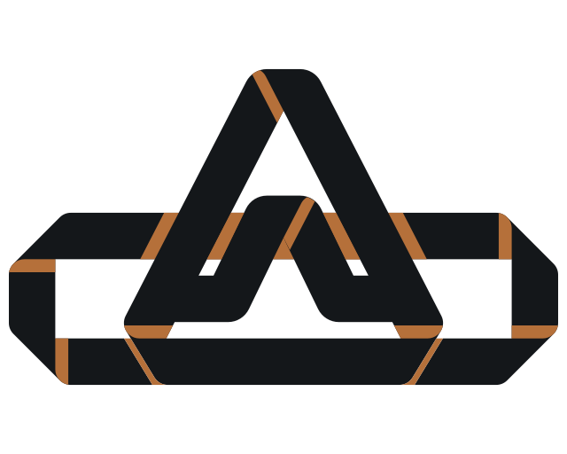
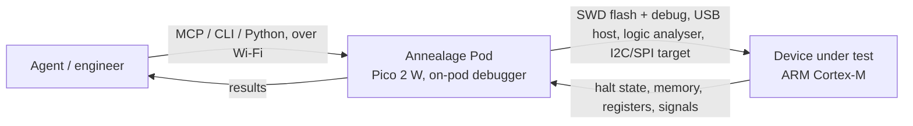

<picture>
  <source media="(prefers-color-scheme: dark)" srcset="assets/pod-slab-dark.svg">
  
</picture>

# Annealage Pod

Wi-Fi hardware-in-the-loop test rig: flash, debug, and exercise a device-under-test over the network, with the debugger running on the pod itself. No wired host, no separate probe.

Annealage Pod is part of [Annealage](https://annealage.ai), the AI harness for agentic hardware development.

---

## Why

An agent can write firmware all day, but the loop breaks the moment the code needs to run on real silicon: did the flash take, is the peripheral toggling, why is it hard-faulting? An LLM normally can't see that, so it guesses.

Pod closes the loop. Wire a device-under-test to an off-the-shelf Raspberry Pi Pico 2 W, and an agent can flash it, halt it, set hardware breakpoints, read its memory and registers, watch its GPIO on a logic analyser, act as an I2C or SPI peripheral to it, and drive the whole build -> flash -> test -> fix cycle itself, over Wi-Fi, through an MCP surface, no human relaying what happened. The debugger runs on the pod, so there's no wired host and no separate probe to babysit.

That's reach into the hardware, and just as much, visibility of it: not "the code compiled" but "the DUT halted at this PC, these registers, this memory, this signal on the wire."



## What it is

The pod runs on an off-the-shelf Pico 2 W (RP2350, CYW43 Wi-Fi). Its native USB controller hosts the DUT; pod management rides Wi-Fi.

The defining decision: instead of the pod *being* a USB debug probe that a host PC drives, the pod *runs the debugger itself* in MicroPython, a PIO-driven SWD line layer, an ADIv5 DP/AP/MEM-AP stack, a Cortex-M control layer, a flash loader, and a GDB server, and exposes flash, debug, reset, and capture over Wi-Fi. A host `pod` CLI, a `Pod` Python client, and a `pod-mcp` MCP server are the control plane. An engineer or an agent drives the same operations.

It replaces a multi-board, wired-USB probe carrier (the dual-RP2040 Octoprobe Tentacle) with a single network-attached board.

## What it does today

Status tags: **validated** = exercised on real hardware (an nRF52840 DUT) with a recorded result; **landing** = implemented, validation in progress; **carrier** = needs the upcoming purpose-built carrier board, not on a bare Pico.

| Capability | Status | |
|---|---|---|
| On-pod SWD debugger (DP/AP/MEM-AP, Cortex-M) | validated | Drives SWD locally at 9.375 MHz; no external probe. FPB breakpoints, DWT watchpoints |
| Flash a DUT over Wi-Fi | validated | Image streamed into pod RAM and programmed over SWD with verify; native nRF52 NVM + generic CMSIS-FLM runner |
| GDB through the pod | validated | A stock `arm-none-eabi-gdb` connects over Wi-Fi: reset-halt, breakpoints, step, backtrace, memory/registers |
| Register / memory peek-poke | validated | Single-shot SWD reads and writes without a full GDB session |
| Logic analyser | validated | PIO capture of up to 32 GPIOs, streamed to the host, decoded to VCD |
| DUT-facing peripherals | validated | Pod acts as a hardware I2C target or a PIO SPI target (stream + register-file, modes 0-3), drives GPIO, reads ADC |
| USB/IP DUT export | validated | Pod hosts the DUT's USB and exports it over Wi-Fi; host `usbip attach` binds it with a normal class driver (CDC forwarded REPL validated) |
| Networking + discovery | validated | Browsable mDNS `_annealage-pod._tcp`, dual-stack IPv4/IPv6, IPv6-first with a fingerprint check so it won't act on the wrong board after a DHCP change |
| Management REPL over Wi-Fi | validated | Socket REPL with a persistent, auto-reconnecting host session |
| DUT UART-over-TCP bridge | landing | On-device and mDNS-advertised; listener validated, DUT byte-path pending a loopback |
| INA228 power telemetry, opto-relays, power switching | carrier | Arrives with the carrier board |

DUT support: the on-pod debugger speaks SWD to ARM Cortex-M targets. Any Cortex-M with a CMSIS pack is reachable in principle through the generic FLM runner; a family is only listed as validated once it has been exercised on that silicon. **nRF52840** is validated end-to-end. **i.MX RT1052** (Cortex-M7, external QSPI flash, on a Seeed Arch Mix) is validated for flash + verify through the NXP pack. **STM32** and **RP2350-as-DUT** are wired-up-pending. Non-Cortex-M parts (ESP32-class) are out of scope for SWD, but still reachable over USB/IP, GPIO/ADC, and the DUT-facing peripherals.

## For agents: the MCP surface

The whole rig sits behind an MCP server (`pod-mcp`, stdio transport) so an agent calls the hardware directly. Add it:

```
claude mcp add pod -- pod-mcp
```

27 tools in three subject-first groups. `pod_` is the pod as a managed device (`pod_discover`, `pod_register`, `pod_info`, `pod_exec`, `pod_mount`, `pod_open`). `dut_` is the device under test by every route: its REPL as a persistent session (`dut_open`, then `session_send`/`session_read`/`session_close`) or as a one-shot (`dut_exec`); its debug port (`dut_identify`, `dut_halt`, `dut_resume`, `dut_reg`, `dut_mem`, `dut_gdb`); its flash (`dut_flash`, `dut_erase`, `dut_reset`); and the USB/IP link that carries its USB (`dut_link`). `bench_` is the pod's instruments pointed at the DUT (`bench_gpio`, `bench_adc`, `bench_la`, `bench_device`, `bench_device_regs`, `bench_uart`).

A CLI invocation is derivable from a tool name and back: MCP `dut_flash` is `pod dut flash`, MCP `bench_la` is `pod bench la`.

That is the "reach into hardware" made concrete: an agent flashes, halts, inspects, and re-flashes a real board without a human in the wire.

## Quickstart

1. **Install the host tooling** from the repository root with `uv tool install .`. This installs `pod` and `pod-mcp`, including the pinned `ampremote` dependency from GitHub; it does not build firmware.
2. **Connect the MCP server** with `claude mcp add pod -- pod-mcp`. The server uses stdio and connects to registered Pods over Wi-Fi.
3. **Build and flash firmware only if needed**: `make` builds `firmware.uf2` and automatically initialises the pinned MicroPython checkout plus the RP2 port's required submodules. It does not recursively fetch dependencies for other MicroPython ports. On a fresh Pico with no probe, hold BOOTSEL while plugging in USB and drag `firmware.uf2` onto the mounted `RPI-RP2` drive. With a wired CMSIS-DAP probe, `make flash` programs it over SWD with both cores halted. Set Wi-Fi credentials in `config.py` (template `config.example.py`).
4. **Wire the DUT** to the pod, at minimum SWD: pod `GP14` -> SWDIO, `GP15` -> SWCLK, and a common ground.
5. **Find and register the pod**: `pod discover`, then `pod register <label>` (browses mDNS, stores the pod's handles and identity fingerprint).
6. **Drive the DUT**: `pod dut flash <label> firmware.bin`, `pod dut reset <label>`, `pod dut gdb <label>` (prints a `target extended-remote host:port` for your gdb), `pod bench la <label> --pins 16-19 --out cap.vcd`, `pod dut open <label>`.

Ports: socket REPL `8266`, USB/IP `3240`, GDB/DAP RPC `3335`, flash-in `3333`, memory-out `3334`, logic-analyser-out `3336`.

## Hardware

Runs today on a bare Pico 2 W with jumper wires to the DUT (3.3V logic only, common ground mandatory). Core pinout:

| DUT connection | Pod side |
|---|---|
| SWD debug / flash | `GP14` SWDIO, `GP15` SWCLK, GND |
| I2C (pod = target) | `GP10` SDA, `GP11` SCL, GND |
| SPI (pod = target) | `GP16` MISO, `GP17` CS, `GP18` SCK, `GP19` MOSI, GND |
| ADC measure | `GP26` / `GP27` / `GP28`, GND |
| Logic-analyser taps | `GP16`-`GP21`, GND |

Full wiring, electrical rules, and the PIO block map are in [`docs/pod/hardware-setup.md`](docs/pod/hardware-setup.md).

A purpose-built Annealage Pod carrier board is in development: it wires the DUT interfaces for you and adds per-rail INA228 power telemetry, opto-isolated relays, and DUT power switching, the parts a bare Pico cannot provide.

## Stack

- **Board:** Raspberry Pi Pico 2 W (RP2350, CYW43 Wi-Fi).
- **Firmware:** MicroPython (rp2 port), composed with [`mbm`](https://pypi.org/project/micropython-branch-manager) (micropython-branch-manager) to add the in-tree `machine-usbhost`, `network-mdns`, and a TinyUSB host backend. No ESP-IDF on this target.
- **Debug stack:** pure MicroPython (`annealage_pod.debug`), PIO SWD, ADIv5 DP/AP/MEM-AP, Cortex-M, FPB, an nRF52 NVM path plus a generic CMSIS-FLM runner, and a binary DAP RPC server with a host-side GDB RSP translator.
- **USB/IP:** an in-tree C module implemented as an lwIP-RAW callback state machine with static buffer pools (no libc malloc on the network path), forwarding raw URBs; a TinyUSB host backend runs the DUT enumeration. The pod is a raw forwarder and runs no USB class drivers of its own.
- **Host tooling:** a Python `pod` CLI, `Pod` client, and `pod-mcp` MCP server, over `ampremote` (a git-pinned async fork of `mpremote`) and raw TCP for the binary streams.

## Docs

- [`docs/pod/hardware-setup.md`](docs/pod/hardware-setup.md) - the wiring reference (SWD, USB host, UART, I2C, SPI, GPIO/ADC, logic-analyser taps, power).
- [`docs/pod/debug-stack.md`](docs/pod/debug-stack.md) - the on-pod debug stack (SWD / DAP / flash, GDB, streaming flash/read).
- [`docs/pod/peripherals.md`](docs/pod/peripherals.md) - the DUT-facing peripherals.
- [`docs/pod/logic-analyser.md`](docs/pod/logic-analyser.md) - the PIO logic analyser and PIO arbiter.
- [`src/host/README.md`](src/host/README.md) - the host `pod` CLI, client, and MCP server.
- [`docs/pod/troubleshooting.md`](docs/pod/troubleshooting.md) - recovering a stuck forwarded DUT REPL.

## License

Annealage Pod is licensed [AGPL-3.0-only](LICENSE). Use it for anything, commercial included; if you distribute it or host a modified version for others, share your source under the same terms. If that doesn't work for you, eg. you want to ship a modified Pod inside a closed product, there's a [commercial licence](COMMERCIAL.md).

The firmware (`src/boards/`, `src/c_modules/`, `src/mpy/`) has an [extra linking permission](LICENSES/LicenseRef-Annealage-firmware-exception.txt), as the built image includes cyw43-driver and BTstack which aren't AGPL-compatible.

Third-party code keeps its own licence: the Waveshare RP2350B board header is BSD-3-Clause, and `src/micropython` has its own. [`REUSE.toml`](REUSE.toml) and the SPDX headers are the per-file record.

Hardware designs are CERN-OHL-S-2.0.

Releases up to `v1.6.0-native-flash-default` shipped with a PolyForm Noncommercial notice; they're also available under AGPL-3.0-only.

"Annealage" and "Annealage Pod" are trademarks of Andrew Leech, see [COMMERCIAL.md](COMMERCIAL.md#trademarks). Contributions welcome, see [CONTRIBUTING.md](CONTRIBUTING.md).
