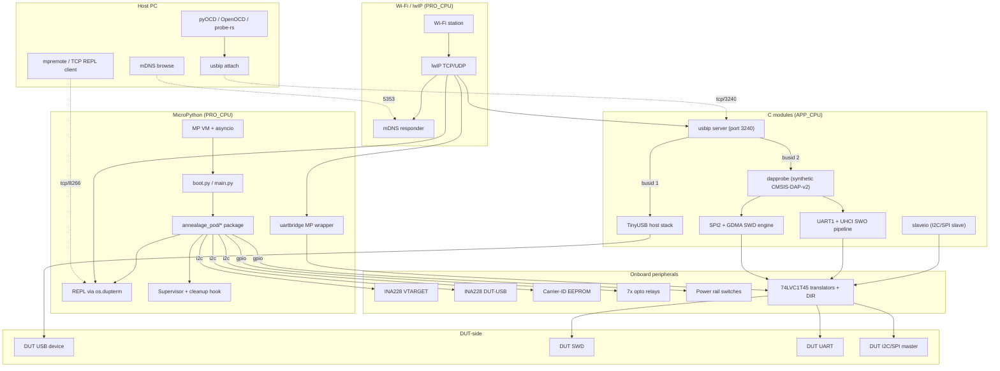
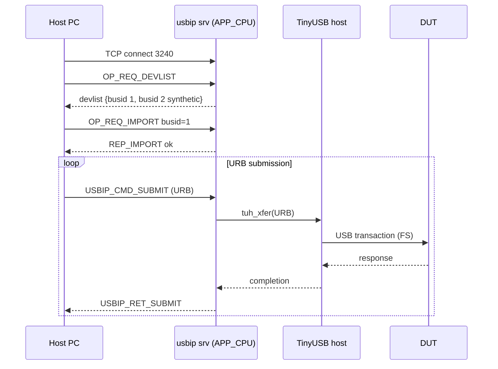
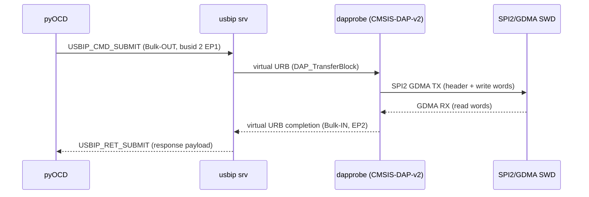
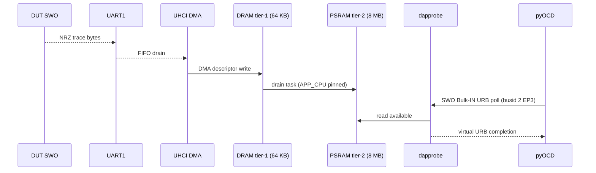
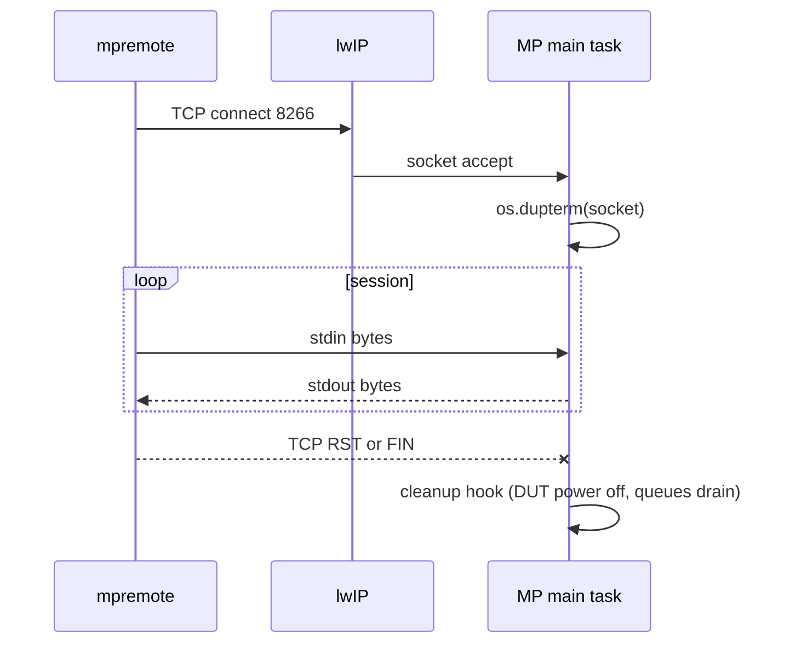
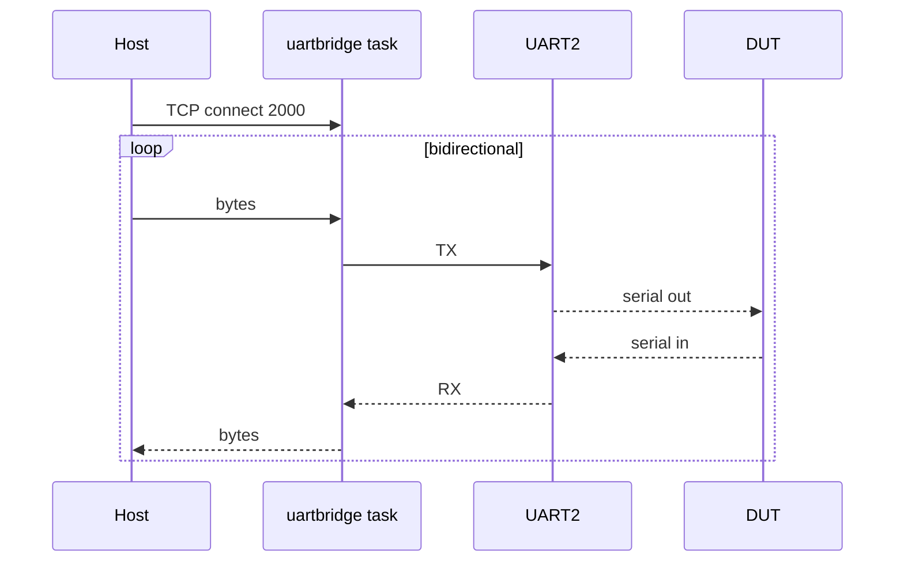

# Annealage Pod Architecture

Companion to `spec.md`. Where the spec describes *what*, this document describes *how the parts compose*. It is the reference for the phased plan in `plan/`.

## 1. Overview

The Annealage Pod is a single ESP32-S3-WROOM-1-N16R8 hosting MicroPython, with three C user modules linking directly against ESP-IDF and lwIP. All host interaction is over Wi-Fi, on four TCP services advertised by mDNS. The DUT is plugged into the S3 as a USB host, and forwarded to the host PC via USB/IP. A synthetic CMSIS-DAP-v2 device is multiplexed onto the same USB/IP server.

## 2. Component model



## 3. Concurrency model

ESP-IDF default places Wi-Fi and lwIP on PRO_CPU. Latency-sensitive tasks are pinned to APP_CPU to avoid Wi-Fi-burst contention.

| Task | Core | Priority | Stack | Notes |
|---|---|---|---|---|
| Wi-Fi (esp_wifi) | PRO_CPU | 23 | IDF default | IDF-managed |
| lwIP TCP/IP | PRO_CPU | 18 | IDF default | IDF-managed |
| mDNS | PRO_CPU | 1 | 4 KB | brought up by MP |
| MP main task | PRO_CPU | 5 | 16 KB | runs Python, asyncio |
| UART bridge task | PRO_CPU | 5 | 4 KB | bidirectional shovel |
| Supervisor | PRO_CPU | 5 | 4 KB | watches REPL socket |
| TinyUSB host | APP_CPU | 6 | 8 KB | URB submission/completion |
| USB/IP server | APP_CPU | 5 | 8 KB | TCP accept + protocol |
| CMSIS-DAP cmd interpreter | APP_CPU | 7 | 4 KB | drains virtual EP |
| SWD I/O (SPI2 / GDMA) | APP_CPU | 8 | inline | invoked from interpreter |
| SWO drain (DRAM -> PSRAM) | APP_CPU | 7 | 4 KB | pinned, polled |
| INA228 sampler | APP_CPU | 4 | 4 KB | periodic, low priority |
| Slave-IO ISR | APP_CPU | ISR | n/a | hardware-driven |

IPC: FreeRTOS message queues for URB handoff, DMA completion semaphores for SWD/SWO, atomic counters for ring-buffer depth.

## 4. Data flow

### 4.1 USB/IP attach + DUT enumeration



### 4.2 CMSIS-DAP transfer over the synthetic device



### 4.3 SWO trace capture



### 4.4 MP REPL via TCP



### 4.5 DUT UART bridge



## 5. Network port map

| Port | Proto | Service | Owner | Notes |
|---|---|---|---|---|
| 3240 | TCP | USB/IP server | C `usbip` | DUT busid 1 + synthetic CMSIS-DAP busid 2 |
| 8266 | TCP | MP REPL | MP boot script | os.dupterm over listening socket |
| 2000 | TCP | DUT UART forwarder | C `uartbridge` | configurable port |
| 5353 | UDP | mDNS responder | IDF mdns component | hostname + service advert |
| 514 | UDP | syslog out (optional) | MP | off by default |
| varies | TCP | OTA pull (HTTPS client) | MP via esp_https_ota | outbound only |

## 6. Partition layout

See `spec.md` §4.2. Bootloader rollback enabled. Validation hook in MP boot path marks the new image valid only after Wi-Fi up + critical services started.

## 7. Module dependency graph

```mermaid
graph LR
  IDF[ESP-IDF v5.x]
  TinyUSB
  lwIP
  PSRAM[octal PSRAM driver]
  mdns
  esp_https_ota
  esp_task_wdt

  MP[MicroPython esp32 port]

  CmodUsbip[c_modules/usbip]
  CmodDap[c_modules/dapprobe]
  CmodUart[c_modules/uartbridge]
  CmodSlave[c_modules/slaveio]

  PyAnnealage Pod["mpy/annealage_pod/* (frozen)"]

  IDF --> MP
  TinyUSB --> CmodUsbip
  lwIP --> CmodUsbip
  lwIP --> CmodUart
  CmodUsbip --> CmodDap
  IDF --> CmodSlave
  PSRAM --> CmodDap
  MP --> PyAnnealage Pod
  PyAnnealage Pod --> CmodUsbip
  PyAnnealage Pod --> CmodDap
  PyAnnealage Pod --> CmodUart
  PyAnnealage Pod --> CmodSlave
  PyAnnealage Pod --> esp_https_ota
  PyAnnealage Pod --> esp_task_wdt
  PyAnnealage Pod --> mdns
```

CmodDap depends on CmodUsbip's virtual-device-injection API. Everything else is loosely coupled.

## 8. Repo layout

```
mpy-pod/
├── README.md
├── docs/
│   ├── spec.md
│   ├── spec-appendix-A-pinmap.md       (from agent A)
│   ├── spec-appendix-B-rp_infra-api.md (from agent B)
│   ├── architecture.md                 (this file)
│   └── design/                         (per-workstream design notes)
├── plan/
│   ├── overview.md
│   └── phase-N-*.md                    (one per phase)
├── research/
│   ├── cmsis-dap-survey.md
│   ├── spi2-swd-benchmark.md           (from agent C)
│   └── usbip-multiplexing-design.md    (Phase 0 deliverable)
├── prototypes/
│   └── spi2-swd-spike/                 (from agent C)
├── src/
│   ├── micropython/                    (submodule)
│   ├── boards/ESP32_S3_ANNEALAGE_POD/       (custom MP board variant)
│   ├── c_modules/
│   │   ├── micropython.cmake
│   │   ├── usbip/
│   │   ├── dapprobe/
│   │   ├── uartbridge/
│   │   └── slaveio/
│   ├── mpy/annealage_pod/                   (frozen Python package)
│   └── tools/                          (host-side helper scripts)
├── test/
│   ├── unit/
│   ├── integration/
│   └── ci/
└── referencea/                         (existing reference submodules)
```

The split:

- `src/c_modules/` is built as MicroPython USER_C_MODULES.
- `src/boards/ESP32_S3_ANNEALAGE_POD/` is a board variant under `src/micropython/ports/esp32/boards/`. It pins sdkconfig (USB host, octal PSRAM, partitions) and includes the user C modules.
- `src/mpy/annealage_pod/` is frozen into the firmware via `MICROPY_FROZEN_MANIFEST`.
- `src/tools/` contains host-side Python helpers (USB/IP attach wrapper, mDNS browse, OTA push).
- `prototypes/` is throwaway / spike code, not built into firmware.
- `referencea/` is read-only reference code from upstream projects; do not modify.

## 9. Build inputs and outputs

Build inputs:

- `src/micropython/` submodule pinned at a release tag
- ESP-IDF pinned via path or submodule (TBD in Phase 1)
- `src/c_modules/`
- `src/boards/ESP32_S3_ANNEALAGE_POD/`
- `src/mpy/annealage_pod/`
- The combined CMSIS-DAP firmware sources (vendored from ARM-software CMSIS-DAP and windowsair/wireless-esp8266-dap into `src/c_modules/dapprobe/vendor/`)

Build outputs (under `build/`):

- `firmware.bin` (combined image, factory or OTA)
- `partition-table.bin`
- `bootloader.bin`
- `*.elf` for debug symbols

Flash flow:

- First-time provisioning: `idf.py -p $(mpy-dev tty esp32-s3) flash` writes bootloader + factory + partition-table over UART0.
- Field updates: HTTPS OTA driven by MP, no UART access required.

## 10. References

- `docs/esp32-s3/spec.md`: requirements and decisions
- `research/cmsis-dap-survey.md`: firmware base, SWD/SWO backend selection, license analysis
- `research/spi2-swd-benchmark.md`: real-silicon validation of the SWD I/O backend (Phase 0 output)
- `referencea/annealage_pod/`: existing Octoprobe Annealage Pod hardware design, source of carrier compatibility
- `referencea/wireless-esp32-dap/`, `referencea/cmsis_dap_tcp_esp32/`: alternative ESP32 CMSIS-DAP implementations consulted in the survey
- `referencea/esp-usbip-bridge/`: existing ESP32 USB/IP bridge (single-device), starting reference for the multiplexer
