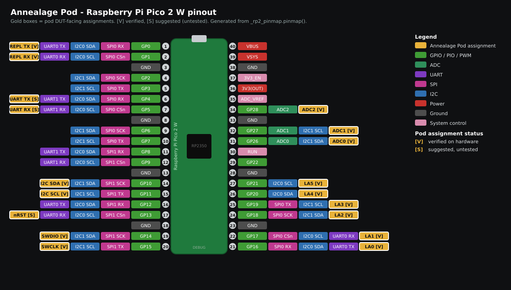

# RP2350 pod: DUT-to-pod hardware setup

How to physically wire a device-under-test (DUT) to the Annealage Pod (RP2350 /
Raspberry Pi Pico 2 W) and bring it up. This is the single wiring reference for
the live RP2350 target; the other RP2350 docs (`debug-stack.md`,
`peripherals.md`, `logic-analyser.md`) cover their subsystem in depth and link
here for the "what wires where" overview.

The pod is a bare RP2350 board running MicroPython. A DUT connects to it through
up to four channels: SWD (the pod debugs/flashes the DUT), USB (the DUT's native
USB is forwarded to a PC over USB/IP), a UART bridge, and assorted GPIO for
functional tests (I2C, SPI, plain GPIO, ADC, logic-analyser taps). You drive the
pod from a PC over Wi-Fi.

Two boards are supported and **every DUT-facing pin below is the same on both**,
so a harness built for one plugs into the other unchanged:

- **Raspberry Pi Pico 2 W** (`ANNEALAGE_POD_RP2350`) - the board this document
  is written against; all pin-budget and header-position notes below describe it.
- **Waveshare RP2350B-Plus-W** (`ANNEALAGE_POD_RP2350B`) - same pin numbers, but
  a 48-GPIO part with a different header layout, more free pins, and its ADC on
  GPIO40-GPIO45 instead of GP26-GP28. See
  `../../src/boards/ANNEALAGE_POD_RP2350B/README.md` for the differences before
  wiring anything to a pin not listed below.

> Authoritative pin facts live in code, not here. Pin numbers below are quoted
> from the board definition and the `annealage_pod` modules; the PIO block
> allocation is owned by `annealage_pod.debug.pio_arbiter.PIO_MAP`. Where a number
> below and the code ever disagree, the code wins - tell the maintainer.

## Status legend

Not every interface is built and proven on the RP2350 yet. Each section is
tagged:

- **VERIFIED** - pins are fixed in firmware and exercised on hardware.
- **SUGGESTED (untested)** - no RP2350 pin is assigned in firmware yet; the pins
  below are a proposal chosen to sit physically near related functions. Do not
  trust them until the maintainer assigns them and they are tested. See
  [Open hardware decisions](#open-hardware-decisions-maintainer-todo).

---

## 1. Safety and electrical rules (read first)

- **3.3V logic only.** RP2350 GPIOs are **not 5V tolerant**. Only drive a pod pin
  with a 0-3.3V signal. For anything higher, put a level shifter or resistor
  divider in line. (`logic-analyser.md` "Wiring the analyser to a DUT".)
- **Common ground is mandatory.** Tie a pod `GND` pin to the DUT ground for every
  connection type, or signals are meaningless and pins are at risk.
- **ADC reference is 3.3V.** Analog inputs must stay within 0-3.3V
  (`peripherals.py` `adc()`).
- Keep leads short for fast signals (SWD, SPI, logic-analyser capture).

## 2. What you need

- The pod board (a Raspberry Pi Pico 2 W, or a Waveshare RP2350B-Plus-W), with
  male headers or solder leads.
- Jumper wires; a breadboard helps.
- A CMSIS-DAP probe (e.g. a Raspberry Pi Debug Probe / "pico-probe") to flash the
  pod over SWD, referenced by serial. The same probe doubles as the pod's backup
  UART console (section 5g). Optional on the RP2350B-Plus-W, which is flashed
  over USB in BOOTSEL mode (`make BOARD=ANNEALAGE_POD_RP2350B flash-usb`); a
  probe is still the only way in if its Wi-Fi and USB are both unavailable.
- A host PC with the `pod` tooling and `ampremote` (`src/host/README.md`), plus
  Wi-Fi credentials for the pod.
- The DUT (e.g. an nRF52840 board) and whatever it needs to be powered.

## 3. Pico 2 W pin budget



A rendered pinout (`pinout.svg` / `pinout.png`) shows the pod's assignments in
gold over the stock Pico 2 W pin functions. Regenerate it after any pin change
with `make pinout` (or `python3 tools/pinout_diagram.py`; the PNG output needs
`cairosvg`). What updates automatically vs by hand: the pod's `swd` / `nrst` /
`i2c_target` / `dut_uart` pins come straight from `_rp2_pinmap.pinmap()`, so
those track the code; the stock Pico 2 W pin functions and the fixed pod extras
(backup-REPL GP0/GP1, ADC GP26-28, the LA capture block GP16-21) are tables
inside `tools/pinout_diagram.py` and must be edited there. The table and ASCII
diagram below carry the same information as text.

Header GPIOs exposed by the board are GP0-GP22 and GP26-GP28 (`pins.csv`).
GP23/24/25/29 are **not on the header** - they are internal CYW43 Wi-Fi pins
(driven on PIO2) and must never be touched.

On the RP2350B-Plus-W the equivalent untouchable set is GPIO36-GPIO39 (the RM2
radio, also on PIO2), GPIO46 (VSYS sense) and GPIO47 (PSRAM chip select);
GP23-GP29 there are ordinary pins.

| Pod GPIO | Header pin | Assigned to | Status |
|---|---|---|---|
| GP0 | 1 | Backup UART REPL TX (UART0) - **reserved** | VERIFIED |
| GP1 | 2 | Backup UART REPL RX (UART0) - **reserved** | VERIFIED |
| GP2-GP9 | 4,5,6,7,9,10,11,12 | free (general / logic-analyser capture) | - |
| GP10 | 14 | I2C1 SDA (I2C target peripheral) | VERIFIED |
| GP11 | 15 | I2C1 SCL (I2C target peripheral) | VERIFIED |
| GP12 | 16 | free | - |
| GP13 | 17 | *(suggested DUT nRST)* | SUGGESTED |
| GP14 | 19 | SWDIO (SWD to DUT) | VERIFIED |
| GP15 | 20 | SWCLK (SWD to DUT) | VERIFIED |
| GP16-GP19 | 21,22,23,25 | free / logic-analyser default / *(suggested DUT SPI0)* | mixed |
| GP20-GP22 | 26,27,29 | free (general / logic-analyser capture) | - |
| GP26-GP28 | 31,32,34 | ADC0/1/2 (analog in) | VERIFIED |

Pinout (USB connector at the top; physical pin 1 is top-left, pin 40 top-right,
pin 20 bottom-left, pin 21 bottom-right, as on the board). `[V]` = VERIFIED pod
function, `[S]` = SUGGESTED (untested), no tag = free/general or a power/ground
pin. `LA` marks the logic-analyser default capture block (GP16-GP21), which
overlaps the suggested SPI0 pins.

```text
                                  +---========---+
                                  |    | USB |    |
   [V] UART REPL TX   GP0  - |  1   '-----'   40 | -  VBUS
   [V] UART REPL RX   GP1  - |  2             39 | -  VSYS
                      GND  - |  3             38 | -  GND
                      GP2  - |  4             37 | -  3V3_EN
                      GP3  - |  5             36 | -  3V3(OUT)
   [S] DUT UART TX    GP4  - |  6             35 | -  ADC_VREF
   [S] DUT UART RX    GP5  - |  7             34 | -  GP28  ADC2       [V]
                      GND  - |  8             33 | -  GND
                      GP6  - |  9             32 | -  GP27  ADC1       [V]
                      GP7  - | 10             31 | -  GP26  ADC0       [V]
                      GP8  - | 11             30 | -  RUN
                      GP9  - | 12             29 | -  GP22
                      GND  - | 13             28 | -  GND
   [V] I2C SDA        GP10 - | 14             27 | -  GP21         LA
   [V] I2C SCL        GP11 - | 15             26 | -  GP20         LA
                      GP12 - | 16             25 | -  GP19  SPI0 MOSI  [S] LA
   [S] DUT nRST       GP13 - | 17             24 | -  GND
                      GND  - | 18             23 | -  GP18  SPI0 SCK   [S] LA
   [V] SWDIO          GP14 - | 19             22 | -  GP17  SPI0 CS    [S] LA
   [V] SWCLK          GP15 - | 20             21 | -  GP16  SPI0 MISO  [S] LA
                                  +--------------+
```

GP16-GP21 are the contiguous logic-analyser default capture block; the suggested
SPI0 functions (MISO GP16, CS GP17, SCK GP18, MOSI GP19) sit inside it, so use SPI0
or the default-block analyser one at a time, or move the analyser to GP2-GP9.

Header pin numbers are the standard Raspberry Pi Pico 40-pin layout (identical on
the Pico 2 W); confirm against the official Pico 2 W pinout diagram. Power pins of
note: `3V3(OUT)` = pin 36, `GND` = pins 3/8/13/18/23/28/33/38, `VSYS` = pin 39,
`VBUS` = pin 40, `RUN` (the pod's own reset) = pin 30.

PIO blocks: PIO0 = free (logic analyser, optional write-streamer), PIO1 = SWD,
PIO2 = CYW43 Wi-Fi (reserved). Authoritative: `pio_arbiter.PIO_MAP`.

---

## 4. Interfaces at a glance

| DUT connection | Pod side | DUT side | Status |
|---|---|---|---|
| SWD debug/flash | GP14 SWDIO, GP15 SWCLK, GND | SWDIO, SWCLK, GND | VERIFIED |
| I2C (pod = target) | GP10 SDA, GP11 SCL, GND | SDA, SCL, GND | VERIFIED |
| GPIO functional | any free GP, GND | the DUT pin under test | VERIFIED |
| ADC measure | GP26/27/28, GND | 0-3.3V analog node | VERIFIED |
| Logic-analyser taps | GP16-21 (default), GND | signals to observe | VERIFIED |
| DUT reset (nRST) | *GP13 (suggested)*, GND | nRESET | SUGGESTED |
| UART bridge | *GP4 TX, GP5 RX (suggested)*, GND | RX, TX (crossed), GND | SUGGESTED |
| SPI functional | *GP18 SCK, GP19 MOSI, GP16 MISO, GP17 CS (suggested)*, GND | crossed, GND | SUGGESTED |
| USB host (USB/IP) | native USB connector | DUT native USB | SUGGESTED |
| Backup pod console | GP0 TX, GP1 RX (to probe, not DUT) | n/a | VERIFIED |

---

## 5. Per-interface wiring

### 5a. SWD - debug and flash the DUT (VERIFIED)

The pod runs a PIO SWD debugger (PIO1). Wire three lines:

| Pod | DUT |
|---|---|
| GP14 (SWDIO) | SWDIO / SWD data |
| GP15 (SWCLK) | SWCLK / SWD clock |
| GND | GND |

Default SWCLK is ~4.69 MHz (`clkdiv=16`), inside the nRF52840's 8 MHz maximum;
keep the two SWD leads short. Pins are fixed in `swd_pio.py` / `ops.py`. Usage
and the layered DP/AP/MEM-AP + flash stack are in `debug-stack.md`.

### 5b. I2C - DUT drives the pod as an I2C target (VERIFIED)

The pod can present an I2C **target** (slave) so DUT-as-controller code can be
tested against it (`peripherals.py` `i2c_target`, default addr 0x42 on I2C1):

| Pod | DUT |
|---|---|
| GP10 (SDA) | SDA |
| GP11 (SCL) | SCL |
| GND | GND |

Add pull-ups (typ. 4.7k to 3V3) if the DUT board does not already. The hardware
I2C1 instance constrains the pins (even GP = SDA, odd GP = SCL); see
`peripherals.md`. For the pod acting as I2C **controller** instead, use
`machine.I2C` directly on a free pin pair.

### 5c. GPIO and ADC - functional tests (VERIFIED)

- **GPIO:** `peripherals.py` `gpio(pin, ...)` drives or reads any free header GP.
  Wire the pod GP to the DUT pin under test plus a common GND.
- **ADC:** `adc(pin)` reads GP26, GP27 or GP28 (ADC0-2), 0-3.3V, 12-bit. Wire the
  pod ADC pin to the analog node and share GND.

### 5d. Logic analyser - observe DUT signals (VERIFIED)

A PIO logic analyser (PIO0) samples contiguous GP inputs and streams to a `.vcd`.
Default capture block is **GP16-GP21**; also free for capture are GP2-GP9,
GP22, GP26-GP28. Avoid GP14/GP15 (SWD) and GP10/GP11 (if I2C is in use). Wire each
tap pod-GP to the DUT signal, plus a common GND; inputs are high-impedance, so
only count channels you actually connected. Electrical rules and capture
parameters: `logic-analyser.md`.

### 5e. ADC reference / power sensing

Only the 3 ADC channels above are exposed; there is no current/voltage telemetry
on the bare Pico 2 W (INA228 + power-rail switching are deferred to a future
carrier, see `src/boards/.../README.md` and `plan/phase-5`).

### 5f. Backup pod console (VERIFIED, pod-side - not a DUT link)

This is how you reach the pod over a wire when Wi-Fi is down; it does not touch
the DUT. The pod exposes a backup REPL on UART0 (GP0 = TX, GP1 = RX, 115200),
cross-wired to the debug probe's UART bridge (the Debug Probe's bridge is UART1 on
GP4 = TX / GP5 = RX):

| Pod | Probe |
|---|---|
| GP0 (TX) | probe GP5 (RX) |
| GP1 (RX) | probe GP4 (TX) |
| GND | GND |

So one pico-probe gives both SWD programming and a backup console. Details:
`src/boards/ANNEALAGE_POD_RP2350/README.md` and `dev-notes.md`.

### 5g. DUT reset (nRST) - GP13 (VERIFIED)

The RP2350 DUT-reset pin is **GP13 (header pin 17)**, from
`_rp2_pinmap.NRST`. It is free and sits next to the SWD cluster (GP14/GP15) at
the bottom-left of the header, so SWDIO/SWCLK/RESET form one tidy 3-wire debug
group.

| Pod | DUT |
|---|---|
| GP13 (open-drain) | nRESET |
| GND | GND |

The pod drives the line open-drain: it pulls low to assert reset and releases to
high-Z, so **the DUT must provide its own reset pull-up** - the pod never drives
the line high and cannot deassert a reset on a line nothing pulls up. Reset it
with `pod reset --mode nrst <pod>`, which reports `level`, the line after
release; a `level` of 0 means the line stayed low, i.e. no DUT pull-up or the DUT
is holding its own reset.

Unlike the SWD paths, this one needs no debug session, so it is the reset of last
resort when SWD is unavailable - target unpowered, wedged, or access-port locked.

> **The pod parks this line at boot, and that is load-bearing.** An RP2350 pad
> powers up with its internal pull-down enabled, so a GPIO no code has configured
> is not high-impedance: it actively pulls its net down. On a DUT whose reset
> pull-up is weaker than the pad's (roughly 50-80k) the pull-down wins and holds
> the DUT in reset from the moment the pod powers on, with nothing having asked
> for a reset. `netboot.main()` therefore calls `annealage_pod.debug.nrst.park()`
> before anything else touches the DUT. If you port this boot path, keep the park.

Verified on hardware 2026-09-02 (RP2350B pod, i.MX RT1052 Arch Mix DUT): asserting
drove the line to 0 and releasing returned it to 1, and a pulse set the target's
`DHCSR.S_RESET_ST` sticky bit and cleared `C_DEBUGEN`, confirming the core really
was reset rather than merely the wire wiggled.

### 5h. DUT UART bridge - SUGGESTED (untested)

No RP2350 DUT-UART pins are assigned in firmware yet (`plan/phase-5`).
**Suggested: hardware UART1 on GP4 = TX, GP5 = RX (header pins 6, 7)** - a free,
adjacent pair on the left header.

| Pod | DUT |
|---|---|
| GP4 (UART1 TX) | DUT RX |
| GP5 (UART1 RX) | DUT TX |
| GND | GND |

TX/RX cross over (pod TX to DUT RX). UART0 (GP0/GP1) is taken by the backup
console, so the DUT bridge must use UART1 or a PIO UART.

### 5i. DUT SPI - SUGGESTED (untested)

No RP2350 SPI pins are assigned in firmware yet (`plan/phase-5`). **Suggested:
SPI0 on GP18 = SCK, GP19 = MOSI, GP16 = MISO, GP17 = CSn (header pins 23, 25, 21,
22)** - the canonical RP2 SPI0 block, contiguous on the right header, so it matches
every Pico SPI tutorial.

| Pod | DUT |
|---|---|
| GP18 (SCK) | SCK |
| GP19 (MOSI) | MOSI / SDI |
| GP16 (MISO) | MISO / SDO |
| GP17 (CSn) | CS |
| GND | GND |

Note: GP16-GP19 overlap the logic analyser's default capture block (GP16-21). Use
SPI **or** the default-block analyser at once, or move the analyser to GP2-GP9.

### 5j. USB host - forward the DUT over USB/IP - SUGGESTED (untested)

The pod's **native USB connector** is the DUT host port; there are no GPIO to wire
(`mpconfigboard.h`: `MICROPY_HW_USB_HOST`). The DUT's native USB connects to it,
and the pod raw-forwards the device to a PC over USB/IP.

What is **not yet settled** (and not yet proven - no DUT has enumerated on the port
yet, `plan/phase-4`): the physical cable/adapter from the pod's USB connector to
the DUT, how VBUS is supplied to a bus-powered DUT, and current limits. Treat this
as experimental until the maintainer specifies it.

---

## 6. Power and ground

What is known:

- 3.3V logic throughout; common ground across every interface (section 1).
- The pod's `3V3(OUT)` (pin 36) can power a small 3.3V DUT; for anything drawing
  real current, power the DUT from its own supply and just share GND.

What the maintainer still needs to specify (see Open decisions):

- How the **pod itself** is powered (VSYS/VBUS/probe), since the native USB
  connector is configured as a host and is not the pod's power inlet in the usual
  way.
- The VBUS path to a bus-powered DUT for the USB-host case.

---

## 7. Bring-up order

1. **Flash the pod** over SWD with the wired probe (by serial). From the repo
   root: `make flash` (builds, flattens the multi-section UF2, flashes via
   `probe-rs`; see the top-level `Makefile` and `dev-notes.md`). Underlying recipe
   and the UF2-flatten rationale: `src/boards/ANNEALAGE_POD_RP2350/README.md`.
2. **Set Wi-Fi credentials:** create `config.py` on the pod
   (`cp config.example.py config.py`, edit SSID/password). It is not frozen, so it
   changes without a rebuild (`board README` "Configuration").
3. **Power-cycle / reset** the pod; it brings up Wi-Fi and a socket REPL over
   `os.dupterm`, announced by mDNS.
4. **Discover and connect** from the host: `pod` discover/register, then drive
   flash/reset/read over Wi-Fi (`src/host/README.md`).
5. **Wire the DUT** for the interfaces you need (sections 5a-5j), then exercise
   each from the host (`pod` CLI / Python client / MCP).

---

## 8. Open hardware decisions (maintainer TODO)

The guide is complete for the VERIFIED interfaces. These items block writing the
full guide and need a hardware decision plus a firmware change before the
SUGGESTED sections can be promoted to VERIFIED:

- **DUT nRST pin.** Done in code (needs a hardware test). `_rp2_pinmap.NRST` is
  GP13, so it can't collide with SWDIO. Still unexercised: validate `pod reset --mode nrst` on
  GP13 once `plan/phase-5` wires it up.
- **DUT UART pins.** Assign UART1 (suggested GP4/GP5) or a PIO UART.
- **DUT SPI pins.** Assign SPI0 (suggested GP16-GP19) or a PIO SPI.
- **USB-host physical setup.** Specify the connector/cable, VBUS source for a
  bus-powered DUT, and current limit; then prove enumeration (`plan/phase-4`).
- **Power model.** Specify how the pod is powered and the DUT VBUS path.

---

## 9. Sources

Pins and behaviour above derive from:

- Board: `src/boards/ANNEALAGE_POD_RP2350/pins.csv`, `mpconfigboard.h`, `README.md`.
- PIO map: `annealage_pod.debug.pio_arbiter.PIO_MAP` (authoritative).
- SWD: `annealage_pod/debug/swd_pio.py`, `ops.py`; usage in `debug-stack.md`.
- Peripherals (I2C/GPIO/ADC): `annealage_pod/peripherals.py`; usage in `peripherals.md`.
- Logic analyser: `annealage_pod/debug/logic_analyser.py`; usage and electrical
  rules in `logic-analyser.md`.
- Host workflow: `src/host/README.md`.
