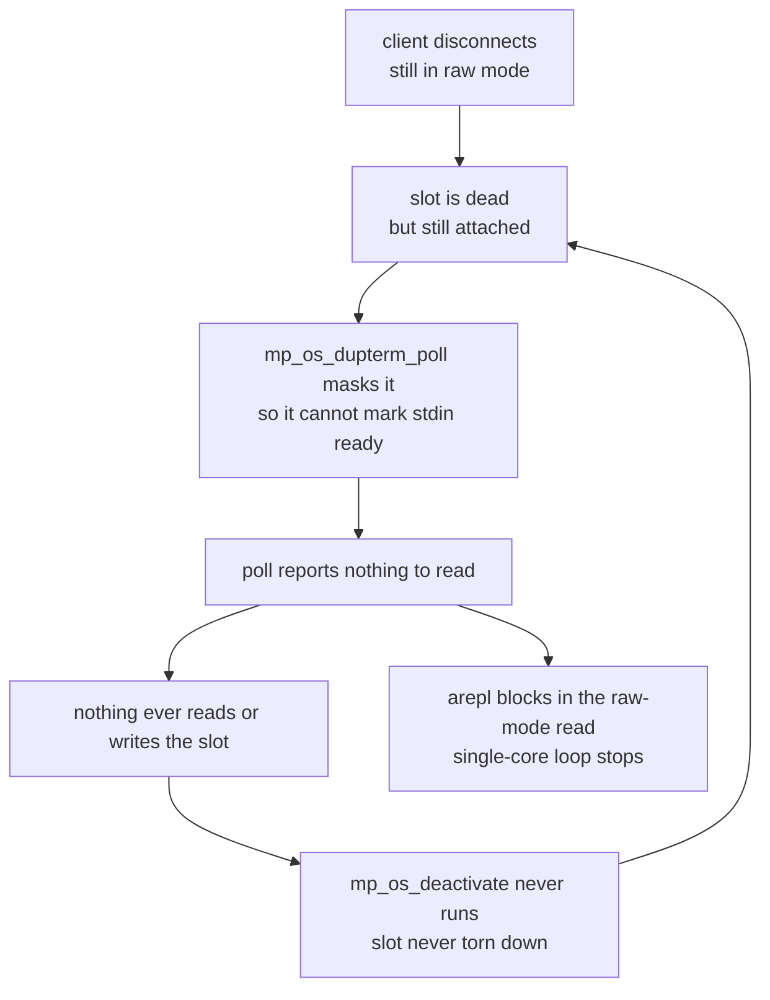

# Upstream plan: the socket REPL raw-mode disconnect fix

Composition and submission plan for the `src/micropython` work behind the pod's
socket-REPL wedge. Two commits, split along a dependency seam, staged on fork
branches so each can travel at its own pace.

## The fault

A client that disconnected from the pod's socket REPL **while still in raw mode**
stopped the pod's single-core asyncio loop outright. The accept loop, Wi-Fi
supervisor and UART bridge all stopped being scheduled; the listener stayed
bound, so connections still completed their TCP handshake and were then never
served. From the host that looks like a pod that answers and says nothing, and
only a reset cleared it. `mpremote` and `ampremote` never trigger it because they
send Ctrl-B before closing.

The mechanism is a circular dependency between two pieces that are each correct
alone:

The masking (`86213f47a7`) exists to stop a closed slot wedging a poll-driven
reader by falsely marking stdin ready. It does that, and in doing so makes the
slot invisible: nothing reads it, so it is never deactivated, so nothing can tell
the reader its source is gone.

## The split

The fix is two commits with a real dependency between them, which is why they are
staged separately rather than as one change.

| Branch | Base | Contains |
|---|---|---|
| `os-dupterm-generation` | `86213f47a7` | The C half: publish `os.dupterm_generation()`, bumped on teardown and when a slot is seen dead during a poll. |
| `arepl-raw-mode-disconnect` | `native_async_repl` | The above, plus the arepl consumer: bounded wait in the raw-mode read, consult the counter, leave raw mode when the source is gone. |

`tessera` merges `arepl-raw-mode-disconnect`; that is what the pod's firmware
builds from, and the superproject gitlink tracks it.

The pod also needs a change outside this submodule: `netboot` must restart the
REPL task when it returns, because `main()` awaits it last and would otherwise
unwind the whole runtime. That half lives in `src/boards/common/netboot.py`.
**Both halves are required.** The arepl change alone converts a park into a clean
unwind that still takes the management plane down.

## Submission order and constraints

`86213f47a7` is fork-only. The counter sits directly on top of it and is
meaningless without it, so the C half cannot go upstream on its own: it travels
either with that commit or with the async REPL feature as a whole.

`extmod/asyncio/arepl.py` does not exist upstream at v1.29.0, nor does
`micropython.repl_event` or `MICROPY_COMP_ALLOW_TOP_LEVEL_AWAIT`. The arepl
commit therefore reaches upstream only when `native_async_repl` does, and should
be reviewed as part of it rather than proposed separately.

Order:

1. `os-dupterm-generation` reviewed against `86213f47a7` as its parent. Small
   enough to review on its own, and the seam is a genuine one, so it is worth
   keeping distinct even if the two land together.
2. `arepl-raw-mode-disconnect` folded into the `native_async_repl` submission.

## Validation

On the RP2350 pod, nRF52840 DUT attached, both halves in place: fifteen
consecutive abrupt raw-mode disconnects (`SO_LINGER 0` while in raw mode), each
recovered with no reset. A host tool killed with SIGTERM mid-exec likewise. The
DUT SWD link was healthy throughout.

Reproduction, for anyone re-testing: connect, send Ctrl-A, then close with
`SO_LINGER 0` without sending Ctrl-B. Note that a probe which enters raw mode and
closes politely will not reproduce it, and that any probe driving the CLI will
repair the device it is measuring, because the prompt-poll preamble writes before
it reads. Drive a command to completion as the health check instead of looking
for a prompt: a leftover raw-mode session answers a prompt probe while being
unusable.

## Not addressed here

A busy device cannot be interrupted over the socket REPL at all. Measured: the
same Ctrl-C that aborts a `time.sleep(12)` over the probe UART in 1.8s is ignored
over the socket, and the sleep runs to completion. The interrupt char is armed
correctly around execution by `pyexec`; the byte simply never arrives, because
nothing services a dupterm socket slot during synchronous execution. That is a
port-level question about the event-poll hook, not an arepl one, and no change in
`arepl.py` can reach it. Routing work through top-level `await` does not help
either: raw mode rejects it outright (`'await' outside function`, since the
compiler flag is only set by the friendly-REPL line executor), and in the friendly
REPL where it does run, the cancel still needs the same byte to arrive.

---

## Draft PR: `os-dupterm-generation`

**Title:** `extmod/os_dupterm: Report when a dupterm slot is seen dead.`

### Summary

Chasing a wedge on a network-attached board, I found a dead dupterm slot can sit
attached and completely invisible. The masking added in the parent commit stops a
closed slot marking stdin ready, which is what keeps it from wedging a poll-driven
reader. The side effect is that nothing then reads or writes that slot, so it is
never deactivated either, and a reader waiting on stdin has no way to tell "no
byte has arrived yet" from "the source I am reading is gone and never coming
back".

On a single-threaded asyncio runtime that difference decides whether the event
loop keeps running. The detection already existed inside the masking branch; it
just was not published.

This adds a counter, bumped both when a slot is torn down and when one is seen
dead during a poll, exposed as `os.dupterm_generation()`. A reader snapshots it
before a blocking wait and compares afterwards. Monotonic, never reset, so a wrap
takes 2^32 tear-downs.

### Testing

Built and run on RP2350 (Pico 2 W) with a socket REPL over Wi-Fi. Verified the
counter increments both on a clean disconnect and on an abrupt reset, and that a
reader blocked on stdin observes the change. The consumer that uses it lives on
`arepl-raw-mode-disconnect`; fifteen consecutive abrupt disconnects recovered
without a reset with both in place.

Not tested on ports without `MICROPY_PY_OS_DUPTERM`, where the accessor is
compiled out along with the rest of dupterm.

### Trade-offs and Alternatives

Four bytes of BSS and a branch already on the poll path, so the cost is
negligible. The counter is global rather than per-slot, which means a reader
learns that *some* slot died rather than that *its* slot died. Per-slot would be
more precise, but a reader on `sys.stdin` is reading the aggregate of all slots
and has no slot identity to compare against, so the extra precision would not be
usable from Python without also exposing which slot feeds a given read.

I first tried bumping only in `mp_os_deactivate`. That does not work, and the
reason is the point of the change: with the slot masked, deactivation never
happens, so a counter that only moves there never moves at all.

### Generative AI

I used generative AI tools when creating this PR, but a human has checked the
code and is responsible for the description above.

---

## Draft PR: `arepl-raw-mode-disconnect`

**Title:** `extmod/asyncio/arepl: Leave raw mode when the input source disappears.`

### Summary

A client that disconnects from a socket REPL without leaving raw mode used to
take the whole event loop with it. In raw mode input is fed synchronously, with
no await, so a concurrent task's stdout cannot corrupt a raw or raw-paste
transfer. The read backing that was unbounded, which is fine while stdin is a
UART but not when it is a dupterm slot that can vanish: no further byte can
arrive, and on a single-threaded runtime nothing else runs again. On a board
whose only management channel is that REPL, this strands it until a reset.

The wait is now bounded, and `os.dupterm_generation()` is consulted on each pass;
a change means the source is gone, so it takes the same path as a clean EOF. The
bound is not load-bearing for correctness, only for how quickly this is noticed,
so it stays generous and a slow paste is unaffected. It still does not await, so
the property the synchronous feed exists to protect is preserved.

The check runs on every pass rather than only on a timeout, because a slot can be
dead while still attached: nothing has read it, so it has not been deactivated.

### Testing

RP2350 (Pico 2 W), socket REPL over Wi-Fi, nRF52840 attached over SWD. Fifteen
consecutive abrupt raw-mode disconnects (`SO_LINGER 0` after Ctrl-A, no Ctrl-B),
each recovered with no reset; previously the first one wedged the board. A host
tool killed with SIGTERM mid-exec also recovers. Normal `mpremote` sessions,
raw-paste transfers and mounts are unaffected, as they leave raw mode before
closing.

Needs the application side to restart the REPL task when it returns; if
`arepl.task()` is the last await in a `main()`, returning ends `asyncio.run()`
and cancels everything else with it.

### Trade-offs and Alternatives

A poll every 500ms while idle in raw mode instead of a blocking read. That window
only decides detection latency, not correctness, so it can be raised if the wakeups
matter on a battery target.

The obvious cheaper change is to await on poll timeout instead of bounding the
wait. I avoided that deliberately: it reintroduces exactly the interleaving the
synchronous feed prevents, and on a board with concurrent writers to stdout a
task's output can land mid-transfer. Trading a hang for silent protocol
corruption is a bad deal, since the hang at least announces itself.

### Generative AI

I used generative AI tools when creating this PR, but a human has checked the
code and is responsible for the description above.
